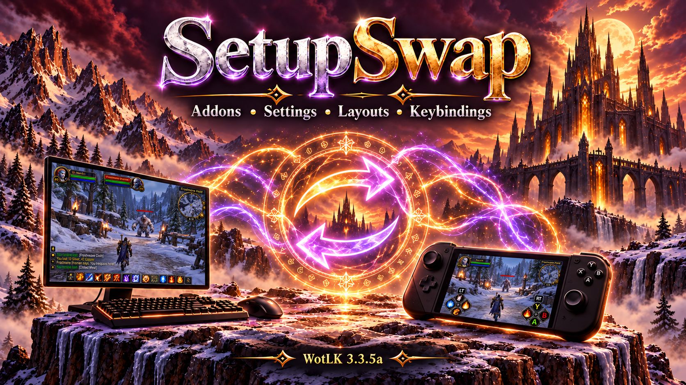

# SetupSwap

**Your addons, your layout, your keybindings—ready for the way you want to play.**

SetupSwap saves reusable setups for **World of Warcraft: Wrath of the Lich King 3.3.5a**.  Each profile can remember which addons are enabled, their captured settings and positions, your chat layout, and your native WoW keybindings.  Switch from the settings window, a slash command, or the minimap button to bring that setup back.

Move from your desktop to handheld remote play on the couch.  Swap a questing interface for a focused raid layout.  Keep the same addon in several profiles with different settings and positions.  Set it up once, save it, and return to it when you need it - all without ever logging out of the game.

## A setup for every way you play

- **Desktop to couch:** Instantly swap between a mouse and keyboard desktop setup or a ConsolePort controller setup, with different addons, window positions, chat layouts, and keybindings.
- **A restore point for your current setup:** save settings before experimenting with addon options, window positions, chat, or keybindings.  Reapply that same profile to return to the saved setup; you can use SetupSwap without switching to a different profile.
- **Questing and leveling:** enable your quest tracker, navigation tools, and leveling helpers, with room to read objectives and explore.
- **Raids and dungeons:** disable questing addons you do not need and enable your encounter tools, raid utilities, and group interface.  Restore the questing setup when the run ends.
- **PvP and arenas:** maintain a separate selection of combat tools, screen layouts, and bindings for competitive play.
- **Farming, gathering, and the auction house:** bring up the maps, trackers, crafting tools, and trading addons that suit the task.
- **Different roles or activities:** build setups for healing, tanking, damage, casual play, or a cleaner screen for screenshots.  Activation is manual, so you choose when to switch.
- **The same addon, different preferences:** an addon shared by two profiles can have different captured settings, visible windows, and positions in each.  Your navigation window can sit neatly in a desktop layout and move out of the way of controller bars in another.

SetupSwap does not provide remote streaming or controller input itself.  It remembers the interface setups you use with those tools.  ConsolePort and the addons mentioned above are examples, not required dependencies.

## What a profile can remember

| Part of your setup | What SetupSwap saves |
| --- | --- |
| Addon selection | Enabled and disabled addons, including enabled load-on-demand modules |
| Addon settings | Detected serializable SavedVariables and supported native addon profiles |
| Window layouts | Detected addon frame positions and supported layout settings |
| Chat | Blizzard chat window configuration and positions |
| Keybindings | Native WoW key assignments, restored when the profile is activated |

Settings capture discovers addon data automatically rather than requiring a hand-written integration for every addon.  It supports ordinary SavedVariables, recognized AceDB databases, and detected movable frames.  There is no artificial byte, entry, or nesting limit on capture; available game memory and serializable data still set practical limits.

Profiles are **account-wide** and available to your other characters.  You can also use a profile for addon selection alone by leaving settings restoration disabled.

## Installation

[Download SetupSwap.zip](https://github.com/SuttonX/SetupSwap/releases/latest/download/SetupSwap.zip)

1. Fully close WoW.
2. Extract **SetupSwap.zip**.
3. Place both **SetupSwap** and **!SetupSwapLoader** in `Interface/AddOns`.
4. Enable both addons and log in.

The included startup helper allows settings to be restored early during profile switches.  No separate addon download is required.  For updates, replace both folders and keep your SavedVariables.

## Save your first complete setup

1. Open `/ss` or left-click the minimap button.
2. Enter a profile name and choose its addons.  **Use current** populates addons currently enabled by the player, including enabled modules that are not loaded in memory.
3. Click **Save profile**.  This saves **only the enabled/disabled addon list**.  It does not capture settings, positions, chat, or keybindings.
4. Click **Switch + Reload** to activate that profile.  A newly named profile also offers to enable its addons immediately.
5. Arrange the UI and make any keybind changes.  Configure the addons and chat the way you want them.
6. Reopen SetupSwap and click **Save settings & positions**.  This captures the setup, including keybindings, using a reload to flush addon settings.

**Saving or selecting a profile in the editor does not activate it.  Switch to it before saving its settings.**

Repeat for your other setups.  Save settings again after changing positions, addon configuration, chat, or bindings.  Existing profiles without a keybinding snapshot keep the current bindings until their settings are captured again.

## Switch your way

- **Settings window:** select a profile, then click **Switch + Reload**.
- **Quick command:** type `/ss desktop`, `/ss gamepad`, or `/ss` followed by your saved profile name.
- **Minimap menu:** right-click the minimap button and choose a saved profile.

The editor automatically selects a profile whose saved addon list matches the currently enabled addons.  **Select profile** brings another profile up for editing; it does not switch to it.

Switches normally aim to finish with **one reload**.  When early restoration is unavailable, a **Continue Reload** prompt provides the second-reload fallback.  UI hangups after switching can usually be resolved with an additional `/reload` command.  Switching and settings capture must happen outside combat.

## Clear choices before a settings overwrite

When **Save settings & positions** detects that the selected profile or edited addon list differs from the enabled addons, it offers:

- **Save + Switch:** save the displayed addon list and activate it.  Arrange that setup, then save its settings separately.
- **Overwrite:** deliberately capture the current in-game setup into the selected existing profile, keeping its saved addon list and without switching profiles.
- **Cancel:** leave everything unchanged.

If two profiles have identical addon selections, profile detection cannot automatically identify the current profile.  Choose the correct name from the list before saving settings.

## Adding or removing addons

After installing a new addon, update and save the addon list in each profile that should use it.  **Switch to that profile**, configure the addon, and then save settings again.  An addon missing from an older profile's list is disabled when that profile is activated.

Deleted addons are ignored when matching the installed addon list.  SetupSwap does not install addons or recreate deleted addon folders.

## Commands and reporting

| Command | Action |
| --- | --- |
| `/ss` | Open the settings window |
| `/ss` *name* | Activate a saved profile |
| `/ss list` | List saved profiles |
| `/ss new` *name* | Create an addon-list profile from current enabled states |
| `/ss save` *name* | Save current enabled states to a profile |
| `/ss command` *name* *shortcut* | Assign an optional direct shortcut, such as `/desk` |
| `/ss log` | Open a selectable, copyable diagnostic report |
| `/ss undo` | Restore the last settings backup for the current character |

`/setupswap` is also available.  Existing slash commands from other addons are not replaced.

For an issue report, include the SetupSwap version, affected addons, reproduction steps, and the text from **`/ss log`**.  It includes capture details and restore results without requiring a separate error-catching addon.

## Compatibility and capture scope

Addon settings capture includes selected addons that are loaded.  Open any desired load-on-demand modules before saving their settings.  Unsupported data, cyclic tables, and settings that cannot be discovered or serialized are reported rather than guaranteed to restore.  Ordinary SavedVariables may contain addon history or data as well as preferences.

Keybindings use the client's current account/character binding choice.  Binding snapshots contain key assignments, not macro contents or action-bar spell placements.  Temporary controller override bindings remain managed by their owning addons.

SetupSwap is a setup manager, not a filesystem backup.  Keep a backup of your WTF folder with WoW closed before making major configuration changes.

## Related projects

- [ConsolePortLK Enhanced](https://github.com/SuttonX/ConsolePortLK-Enhanced): an improved version of the ConsolePort backport for WotLK 3.3.5a.
- [FormFreedom](https://github.com/SuttonX/FormFreedom): automatic druid form cancellation for supported actions.

These are separate, optional projects and are not bundled with SetupSwap.

Created by **SuttonX**.  Released under the **MIT license**.
